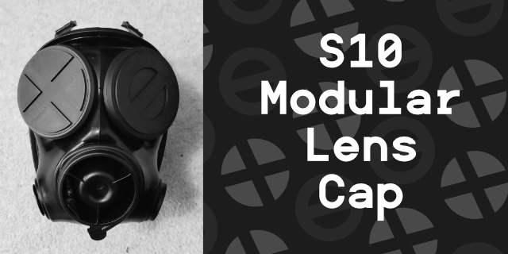

 
 

# ☣️ S10 Modular Lens Cap
A collection of 3D printable files to create Lens caps with interchangable inserts to swap lense or blindfold design

# How to build
- Print 2 of the Bottom, Top and the Insert of your choice
  - Print Settings: No support, 0.2mm layer height, 15% Infill (Basically the default setting is just fine and good looking 😊)
- If you chose the Magnet version, you'll need to fit 3 small 5*2mm magnets to both the insert and top (make sure to check the orientation)
- Glue the Bottom and Top part together using the pegs as a guide

And you're good to go ✨

# 🤔 Too lazy to build yourself? / No 3D Printer?
**I can probably help you out!**

I've opened up a Ko-Fi page to print the files for you with the options for multicoloured printing!

Custom text or Icon, or simply one of the existing design, I offer them for the price of the manufacturing, I'm not trying to make a business out of it 😊

 

# 🎨 Custom Inserts
Here are all of the custom inserts available printed in various colour combinations. 

# ✨ Thanks
This project started by the realisation of how expensive some of the offers for S10 Lens Caps are online where most of them are 3D Printed and fitted with an acrylic disc and window tint.

Thanks to the help of [Gearlicious](https://www.gearlicious.one/) and [Skeele](#) who both provided lens caps models I reproduced and edited here, and some extra suggestion from [Hex](https://linktr.ee/puphex) for the use of magnets, I created a CAD file and then went crazy with modularity!

It all for fun, kink gear is already pretty expensive, so hopefully that can complet your look 😁

# ⚖ License
 
<a property="dct:title" rel="cc:attributionURL" href="https://github.com/Xantw0/S10-Modular-Lens-Cap">S10 Modular Lens Cap</a> by <a rel="cc:attributionURL dct:creator" property="cc:attributionName" href="https://xantw0.net">Xantw0</a> is licensed under <a href="http://creativecommons.org/licenses/by-nc-sa/4.0/?ref=chooser-v1" target="_blank" rel="license noopener noreferrer" style="display:inline-block;">Attribution-NonCommercial-ShareAlike 4.0 International</a>
 

